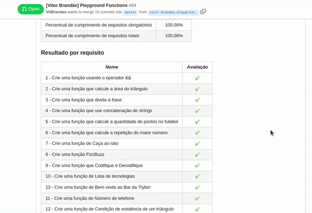

O segundo projeto que desenvolvi como aluno da Trybe foi o 'Playground Functions', onde pude exercitar pela primeira vez meus conhecimentos em Javascript. 

O desafio desse projeto consistia em desenvolver 13 funções específicas utilizando Javascript básico, como operadores lógicos, laços de repetição, estruturas condicionais, arrays e objetos. Para a construção do código, precisei exercitar bastante minha lógica de programação. 

🈂️ (ENGLISH): 'Playground Functions' was the second project I developed as a Trybe student. The challenge this time was about creating 13 Javascript functions to solve 13 specific requirements. To do so, I developed my solutions by combining programming logic with some JS resources, such as conditionals (if), loops (for), array interactions and objects. Check out my complete codes by acessing the files.

Abaixo, está o resultado da avaliação final (🈂️ In the following gif, you can check my final evaluation - 100%):

